# Software Engineering Project A.Y. 2021-2022

## Simulation of the board game Eriantys

**Group GC33**:
- [Callum Venini](https://github.com/SoulFire6)
- [Marco Vitali](https://github.com/MarcoVitali0)
- [Daniele Valenti](https://github.com/danielevalenti)

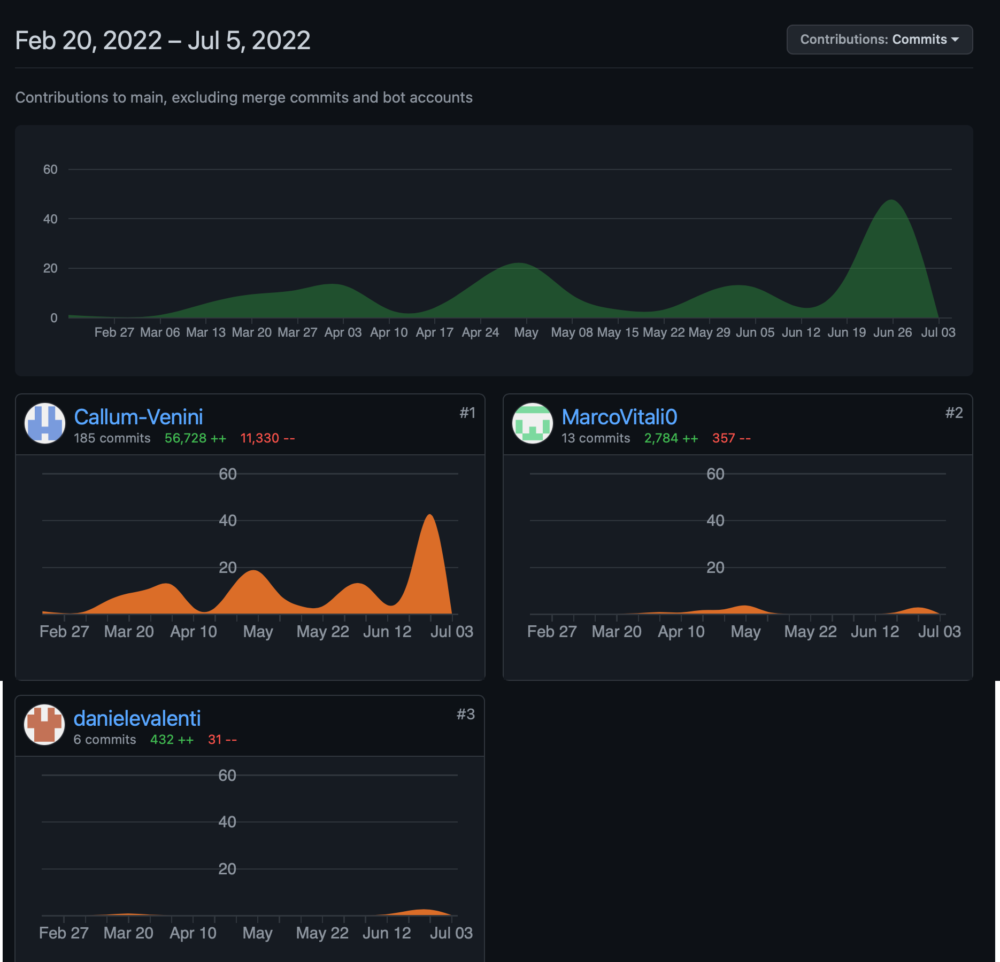

# Table of contents

1. [Project specification](#project-specification)
2. [Implemented Features](#implemented-features)
3. [How to install](#how-to-install)
4. [How to run](#how-to-run)
   1. [Terminal](#terminal)
   2. [Linux/MacOsX](#linux--macosx)
   3. [Windows](#windows)
5. [How to play](#how-to-play)
 

## Project specification

The project consists of a Java application for the board game [Eriantys](https://www.craniocreations.it/prodotto/eriantys/)

The final version will include:
- [x] initial high level UML diagram
- [x] final UML diagrams, automatically generated from the code
- [x] working implementation of the game, compliant to the rules and requirements specified for the project
- [x] documentation for the communication protocol between client and server
- [x] documentation for the peer reviews (2 total)
- [x] source code for the implementation
- [x] source code for the JUnit tests

### Test Coverage

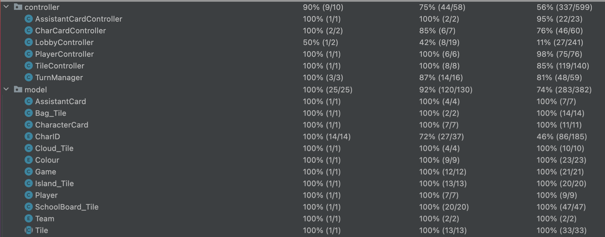

## Implemented features

| Feature                  |       Status       | Details                                       |
|--------------------------|:------------------:|-----------------------------------------------|
| Simplified rules         | :white_check_mark: | Normal mode only                              |
| Complete rules           | :white_check_mark: | Expert mode with 8 character cards            |
| CLI                      | :white_check_mark: | Command line input                            |
| GUI                      | :white_check_mark: | Graphical user interface                      |
| Socket                   | :white_check_mark: | Client-server architecture                    |
| Character cards          | :white_check_mark: | All 12 cards instead of just 8                |
| 4 Player mode            | :white_check_mark: | Allows 4 players to participate in teams of 2 |
| Multiple games           | :white_check_mark: | Allows simultaneous games on the same server  |
| Persistence              | :white_check_mark: | Save and load game state to disk              |
| Disconnection Resilience | :white_check_mark: | Allows players to reconnect                   |

**Table Legend:**

:x: Not implemented

:warning: Work in progress

:white_check_mark: Implemented

## How to install

### Requirements

Java JDK 17

### Compiling

(Skip if using pre-compiled jars)

1. Clone this repository
2. Use a compatible maven version to run clean then package
3. A jar file named ***GC33-[version]*** will be created
4. Run the jar file directly or with a launch file (must be renamed to Eriantys to function with given launch files)

## How to run

### Terminal
    
To get info on command line arguments

    java -jar Eriantys.jar --help

To run client

    java -jar Eriantys.jar -client -u <username> [-cli | -gui ] -ip <server-ip> -p <server-port>

To run server

    java -jar Eriantys -server -p <server-port>

| Command line arg |         Use          | Required                           | Alternate form |
|:----------------:|:--------------------:|------------------------------------|:--------------:|
|      client      |     Start client     | Yes, if running client             |       c        |
|      server      |     Start server     | Yes, if running independent server |       s        |
|       cli        | Specifies CLI client | Yes, if running client             |                |
|       gui        | Specifies GUI client | Yes, if running client             |                |
|       user       |  Specifies username  | No                                 |       u        | 
|        ip        |     Specifies ip     | No                                 |                |
|       port       |    Specifies port    | No                                 |       p        |

### Linux / MacOsX
   
Same as terminal, replacing

    java jar Eriantys.jar

with

    ./Eriantys.bash

For a more permanent solution you can directly add the arguments to the bash file, then just run the bash file

### Windows

Same as with Linux and MacOsX, but with .bat instead of .bash

## How to play

### CLI

On launch, you will see a screen that looks like this

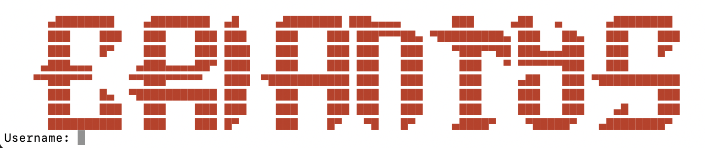

If not established previously through command line arguments or if parameters are incorrect you will be asked for a username, ip and port
You will also be offered the chance to run the server on your client as to avoid having to run one independently, but this means that any crashes or disconnections on your client will affect the server as a whole

After successfully entering the required information, if the server can be reached you will be greeted by the server welcome message, which will require you to choose between creating/joining a lobby or disconnecting

Upon creating a new lobby you will be asked for a name to identify it, this cannot overlap with any currently existing lobbies

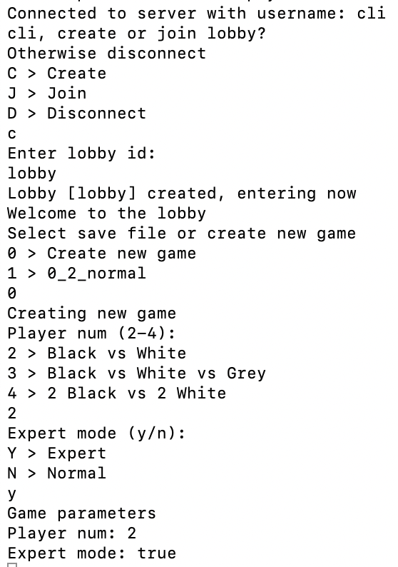

If instead you choose to join a lobby, you will be shown all currently existing lobbies with stats pertaining to player count, game mode, whitelist....

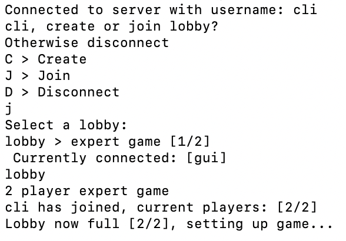

After a game has loaded you will be presented with the game view

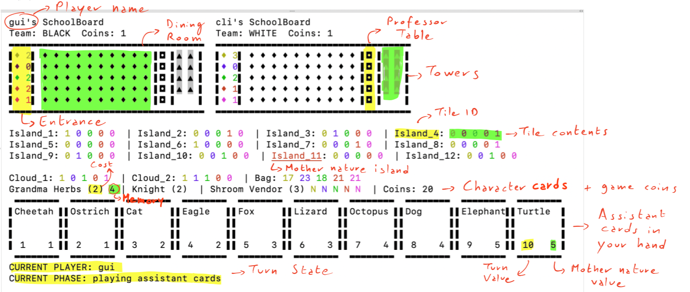

For information on how to perform actions please use the help command

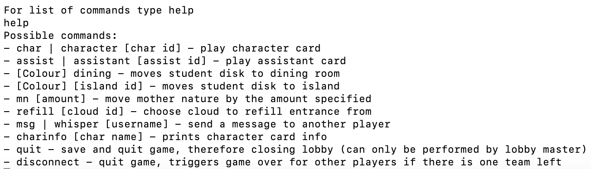

### GUI

On launch, you will be presented with a login page, prefilled with values if specified beforehand on the command line

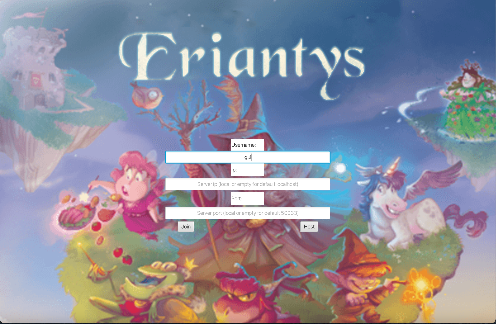

You may choose to join an existing server or host your own from the client itself, fields for ip and port will be filled with default values if empty on either of these buttons being pressed

Next, you will be greeted by the server's main menu, where you will have the same choices as the cli but presented in the form of buttons

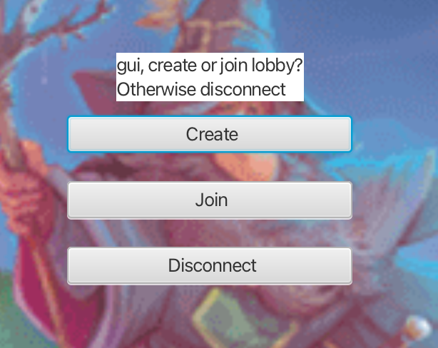

If you chose to create a new lobby you will be asked for a name identifying it, then you can either select an existing save file to load or select parameters to set up a new game

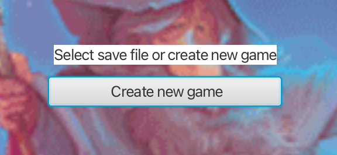

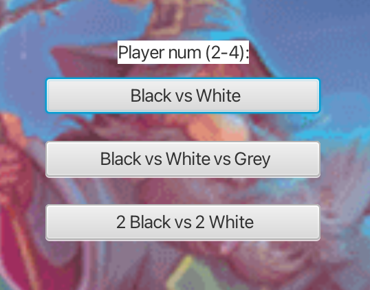

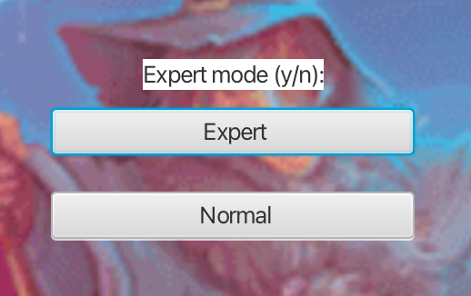

Finally, you will be placed in the lobby's waiting room which shows currently connected players

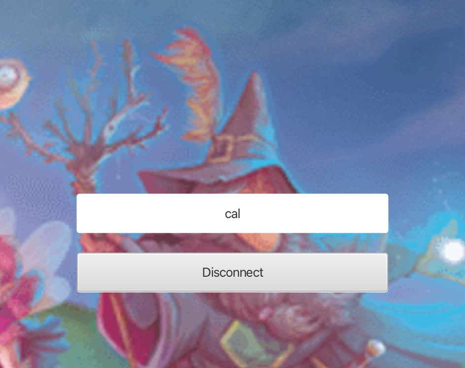

If instead you were to choose to join an existing one, you will be presented with a choice of all active lobbies, with relative info

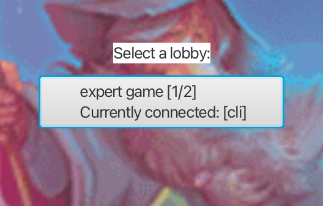

Once a game has started you will be presented with the game view

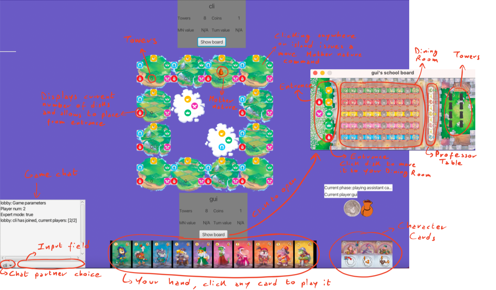

All actions are performed by interacting with the UI elements

## Tools used

- AstahUML - generation of UML diagrams
- IntelliJ IDEA Ultimate Edition - IDE used to manage the project and its dependencies
- JavaFX - GUI Framework of choice
